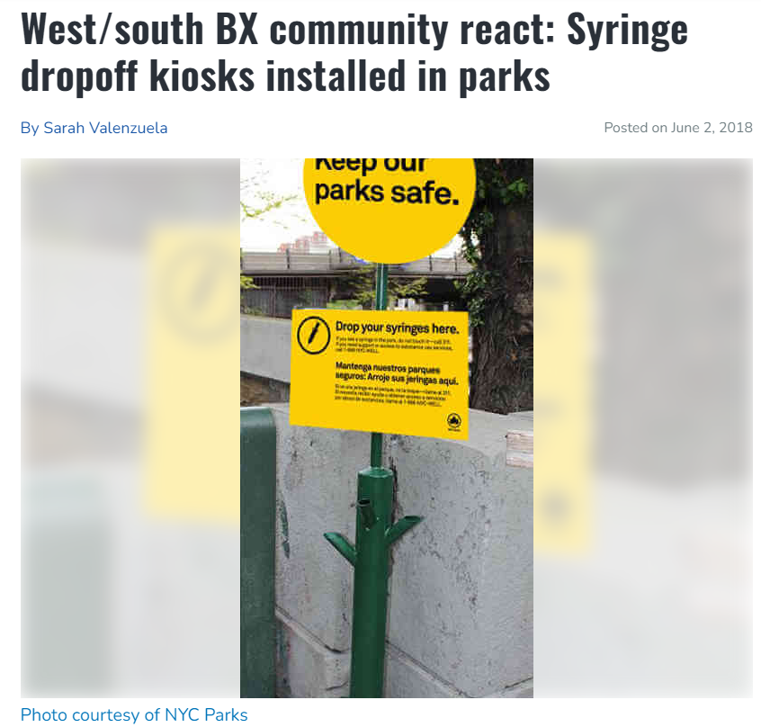

# Final Project 
**Exploratory analysis and essay**  

1. Choose a dataset. You get to decide which dataset you want to work on. The data set must be different from the ones used in previous homeworks You can work on a problem from your job, or something you are interested in. You may also obtain a dataset from sites such as Kaggle, Data.Gov, Census Bureau, USGS or other open data portals.   
2. Select one of the methodologies studied in weeks 1-10, and another methodology from weeks 11-15 to apply in the new dataset selected.  
3. To complete this task:  
    a. Describe the problem you are trying to solve.  
    b. Describe your datasets and what you did to prepare the data for analysis.  
    c. Methodologies you used for analyzing the data  
    d. What's the purpose of the analysis performed  
    e. Make your conclusions from your analysis. Please be sure to address the business impact (it could be of any domain) of your solution.  
  
**Deliverable**  

1. Your final presentation should incliude:    
    a. The traditional R file or Python file and essay  
    b. An Essay (minimum 500 word document) or Video (5 to 8 minutes recording). Include the execution and explanation of your code. The video can be recorded on any platform of your choice (Youtube, Free Cam).


&nbsp;  
&nbsp; 
  

<center style="font-size: 38px"> Syringe Collection Efforts in the Bronx </center>

&nbsp;  
&nbsp;  

<!------- Below is for editing the caption font size | CSS/HTML formatting -------->
<style>
p.caption {
  font-size: 0.8em;
}
</style>

```{r img1-with-knitr, echo=FALSE, fig.align='center', out.width='100%', fig.cap='Credit: [West/south BX community react: Syringe dropoff kiosks installed in parks](https://www.bxtimes.com/west-south-bx-community-react-syringe-dropoff-kiosks-installed-in-parks/)'}


```

&nbsp;  

In 2018, NYC Parks and the Health Department began installing syringe kiosks in select parks across the Bronx as as part of a [plan to reduce the prevalence of discarded syringes](https://www.nycgovparks.org/news/press-releases?id=21566). The plan is part of HealingNYC, the City’s initiative to combat the opioid epidemic stemmed from success seen in similar initiatives in Vancouver, Canada and Seatlle, WA, according to NYC Parks commissioner, Mitchell J. Silver. NYC Parks and local syringe exchange programs deploy staff with blood-borne pathogen training to regularly empty, clean and disinfect kiosks. In addition to installing kiosks, the City works with local syringe exchange programs to increase outreach to people who use drugs in Bronx parks, providing overdose prevention education, information on health and social services, and distributing personal syringe containers.  

Critics of the plan claim that installing syringe kiosks invite and encourage addicts to use drugs in the parks. However, the reality is that people are already using in the parks and disposing of their used needles under benches, bushes, and other places in the parks posing an imminent public health threat to adults, children, and pets that come in contact with them. Coming in contact with needles puts those at risk for contracting infectious diseases such as Hepatitis C and HIV.


```{r message=FALSE, warning=FALSE}
#Packages
library(readr)
library(tidyverse)
library(tidymodels)
library(psych)
library(caret)
library(rpart)
library(rpart.plot)
library(corrplot)
library(RColorBrewer)
library(labelled)
library(ggplot2)
library(ggforce)
library(pROC)
library(mlbench)
library(ModelMetrics)
library(randomForest)
library(e1071)
library(RSocrata)
library(Amelia)
library(kableExtra)
library(lubridate)
library(zoo)
```


# Load Data

The Underlying Causes of death data was obtained from the [CDC Wonder database](https://wonder.cdc.gov/ucd-icd10.html) 

The [Summary of Syringe Data in NYC Parks dataset](https://data.cityofnewyork.us/Public-Safety/Summary-of-Syringe-Data-in-NYC-Parks/t8xi-d5wb) and
The [Parks Properties](https://data.cityofnewyork.us/Recreation/Parks-Properties/enfh-gkve)  [Open NYC Data](https://opendata.cityofnewyork.us/) datasets used to gather data on the syringes collected and parks where syringes are collected. 

```{r message=FALSE, warning=FALSE, class.source='fold-show'}
syr <- read.csv("https://raw.githubusercontent.com/gabbypaola/DATA622/main/Final/Summary_of_Syringe_Data_in_NYC_Parks.csv") 
df_syr <- syr

pk <- read.csv("https://raw.githubusercontent.com/gabbypaola/DATA622/main/Final/Parks_Properties.csv")
df_pk <- pk

dth <- read_tsv("https://raw.githubusercontent.com/gabbypaola/DATA622/main/Final/CountyMonthYearRaceDeaths.txt", show_col_types = FALSE)
df_dth <- dth
```

&nbsp; 

# Exploratory Data Analysis

&nbsp;  

```{r img-with-knitr, echo=FALSE, fig.align='center', out.width='75%', fig.cap='A pile of syringes found under a tree on a sidewalk on St. Anne’s Avenue. These were a few of 1,200 syringes and identifiable needle parts found by the Bronx Ink in the area surrounding the Hub at 149th Street and 3rd Avenue on September 10, 2019. Credit: [A Zone of Neglect](http://bronxink.org/2019/09/19/28351-a-zone-of-neglect/)'}

```

&nbsp; 

## Dimensions, Variable types, Labels, Levels, and Frequencies

### Summary of Syringe Data in NYC Parks  

This dataset contains records of syringes collected, including how many, whether they are collected from the ground or a kiosk, and when they are collected. The Syringe Summary dataset contains records for syringes collected by both Parks staff as well as collection efforts by the [Washington Heights Corner Project](https://www.nycservice.org/organizations/index.php?org_id=1462) and [New York Harm Reduction Educators](https://nyhre.org/) nonprofit group. Each row one instance or one day's total of syringes collected in a park from the ground or safe disposal kiosk.

From the below two functions, the dimensions of the dataset: 24651 rows, 23 columns. The variables read in do not contain any labels and as neither variable is a factor type, there are no factor levels to report. Additionally, the table contains 15 character type variables, 1 double variable, and 7 integer variables.
```{r}
glimpse(df_syr)

look_for(df_syr)

table(look_for(df_syr)$col_type)
```

Below are the counts of unique values for each variable. The purpose of this is to identify if there are any variables that may require a change of variable type from its originally loaded type.

```{r}
# Counts of unique values/levels for each variable
rapply(df_syr, function(x) length(unique(x)))

# unique(df_syr$group)
# unique(df_syr$source)
```


After reviewing the variables, some are updated below. Not all variables will be updated as they will be dropped in the feature selection section.
```{r}
df_syr<- df_syr %>%
  mutate(collected_date =as.Date(str_sub(collected_date, start=1, end=10),format='%m/%d/%Y'),
         kiosk_site = as.logical(toupper(kiosk_site)),
         kiosk_syringes = as.integer(kiosk_syringes),
         kiosk_syringes = coalesce(kiosk_syringes, 0),
         ground_syringes = coalesce(ground_syringes, 0),
         total_syringes = ground_syringes + kiosk_syringes,
         # collection_type = 
         #   case_when(ground_syringes == 0 & kiosk_syringes == 0    ~ "None",
         #             (ground_syringes >= 1 & kiosk_syringes == 0) ~ "Ground",
         #             (ground_syringes == 0 & kiosk_syringes >= 1) ~ "Kiosk",
         #             (ground_syringes >= 1 & kiosk_syringes >= 1) ~ "Ground & Kiosk"
         #             ),
         month_year = paste(month_text, year),
         month = factor(month, levels= c(1,2,3,4,5,6,7,8,9,10,11,12)),
         month_text = factor(month_text, levels= c("Jan", "Feb","Mar","Apr",
                                                   "May","Jun","Jul","Aug",
                                                   "Sep", "Oct", "Nov","Dec")),
         borough = case_when(substring(df_syr$district,1,1) == "M" ~ "Manhattan",
                             substring(df_syr$district,1,1)=="X" ~ "Bronx",
                             substring(df_syr$district,1,1) == "R" ~ "Staten Island",
                             substring(df_syr$district,1,1) == "Q" ~ "Queens",
                             substring(df_syr$district,1,1) == "B" ~ "Brooklyn"
                             )
         )
 
glimpse(df_syr)
```


### Parks Properties 

This dataset, provided by the Department of Parks and Recreation (DPR), identifies property managed partially or solely by NYC Parks. This data has been produced in whole or part using secondary data and is currently owned by the NYC Parks Open Data Team. Data accuracy is limited by the scale and accuracy of the original sources. Site-specific conditions should be field-verified.

Records are added as more land is designated under NYC Parks’ jurisdiction. Each record represents an acquisition.
```{r}
df_pk<- df_pk %>% select(c("GISPROPNUM","ACRES","JURISDICTION","COMMUNITYBOARD",
                           "COUNCILDISTRICT","SUBCATEGORY","TYPECATEGORY",
                           "WATERFRONT", "BOROUGH"))
glimpse(df_pk)

table(look_for(df_pk)$col_type)
```


Below shows counts of unique values/levels for each variable and preliminary data cleaning is conducted.
```{r}
# df_pk<- df_pk %>% select(c("GISPROPNUM","ACRES","JURISDICTION","COMMUNITYBOARD",
#                            "COUNCILDISTRICT","SUBCATEGORY","TYPECATEGORY",
#                            "WATERFRONT"))

# Counts of unique values/levels for each variable
rapply(df_pk %>% keep(is.character), function(x) length(unique(x)))

#display top 10 levels and corresponding counts of selected variables
#df_pk %>% count(JURISDICTION) %>% arrange(-n) %>% head(10)

#first display numeric as non-scientific number, then convert to char, then trim whitespace
df_pk$COMMUNITYBOARD<-trimws(as.character(format(df_pk$COMMUNITYBOARD,scientific = FALSE)))
df_pk$COUNCILDISTRICT<-trimws(as.character(format(df_pk$COUNCILDISTRICT,scientific = FALSE)))

#split strings for community board and council district values, update decimal, and var type
df_pk<-df_pk %>% 
  mutate(COMMUNITYBOARD = ifelse(nchar(df_pk$COMMUNITYBOARD)==3,
                                 df_pk$COMMUNITYBOARD,
                                 str_sub(gsub('(.{3})','\\1,',df_pk$COMMUNITYBOARD),end=-2)),
         COUNCILDISTRICT =  ifelse(nchar(df_pk$COUNCILDISTRICT)==2,
                                 df_pk$COUNCILDISTRICT,
                                 str_sub(gsub('(.{2})','\\1,',df_pk$COUNCILDISTRICT),end=-2)),
         ACRES = round(ACRES,2),
         WATERFRONT = as.logical(toupper(WATERFRONT)),
         BOROUGH = case_when(BOROUGH == "X" ~ "Bronx",
                             BOROUGH == "B" ~ "Brooklyn",
                             BOROUGH == "Q" ~ "Queens",
                             BOROUGH == "M" ~ "Manhattan",
                             BOROUGH == "R" ~ "Staten Island")
         )

#change column cases to lowercase  
names(df_pk) <- tolower(names(df_pk))

#unique(df_pk$borough)
glimpse(df_pk)
```

Next, the syringe collection data is merged with the parks data.
```{r}
df <- left_join(x=df_syr, y=df_pk, by="gispropnum", relationship = "many-to-many")

df <- df %>% select(-borough.x) %>% 
  rename(borough= borough.y)

glimpse(df)  
```

### Underlying Cause of Death

The Underlying Cause of Death database contains mortality and population counts for all U.S. counties. Data are based on death certificates for U.S. residents. Each death certificate identifies a single underlying cause of death and demographic data. The number of deaths, crude death rates or age-adjusted death rates, and 95% confidence intervals and standard errors for death rates can be obtained by place of residence (total U.S., region, state and county), age group (single-year-of age, 5-year age groups, 10-year age groups and infant age groups), race, Hispanic ethnicity, gender, year, cause-of-death (4-digit ICD-10 code or group of codes), injury intent and injury mechanism, drug/alcohol induced causes and urbanization categories. Data are also available for place of death, month and week day of death, and whether an autopsy was performed.

*Note: Stratifying the data into additional groups like gender, race, age causes data loss due to suppression rules in place by the CDC for [Assurance of Confidentiality](https://wonder.cdc.gov/wonder/help/ucd.html#Assurance%20of%20Confidentiality:~:text=What%20are%20the%20Assurance%20of%20Confidentiality%20constraints%20for%20the%20data%3F) constraints. Statistics representing fewer than ten (one to nine) deaths or births are suppressed. Population figures are also suppressed when the population represents fewer than ten persons. This dataset is stratified by County, Month Year, Race, Drug/Alcohol Induced Cause of death.

The dataset has 12 columns and 593 rows where 10 variables are character type, and 2 variables are double type (decimals).

```{r}
glimpse(df_dth)

look_for(df_dth)

table(look_for(df_dth)$col_type)
```

The Underlying Cause of Death dataset contains information for all counties in the state of New York for the years 2018-2021 and causes of deaths include "Drug poisonings (overdose) Unintentional (X40-X44)" and "Drug poisonings (overdose) Undetermined (Y10-Y14)".

The scope of this project is limited to deaths by unintentional overdose for the NYC area, specifically the Bronx. The data will be filtered for the five boroughs for exploratory analysis and county names will be used to add the borough name equivalent.

After filtering for the five boroughs the causes of death remaining are narrowed down to Drug poisonings (overdose) Suicide (X60-X64), Drug poisonings (overdose) Unintentional (X40-X44), and All other drug-induced causes. The data will be filtered further to only include Drug poisonings (overdose) Unintentional (X40-X44). 
```{r}

df_dth <-dth

df_dth <- df_dth %>% 
  select(c("County","Month","Month Code", "Single Race 6","Deaths",
           "Drug/Alcohol Induced Cause")) %>% 
  filter(County %in% c("Bronx County, NY","Kings County, NY", "New York County, NY",
                       "Queens County, NY", "Richmond County, NY"),
         `Drug/Alcohol Induced Cause` == "Drug poisonings (overdose) Unintentional (X40-X44)") %>% 
  mutate(borough= case_when(County == "Bronx County, NY" ~ "Bronx",
                            County == "Kings County, NY" ~ "Brooklyn", 
                            County == "New York County, NY" ~ "Manhattan",
                            County == "Queens County, NY" ~ "Queens", 
                            County == "Richmond County, NY" ~ "Staten Island"),
         year = factor(as.integer(trimws(substr(`Month Code`, 1, 4))), 
                       levels= c(2018,2019,2020,2021)),
         month = factor(as.integer(trimws(substr(`Month Code`, 6,7))), 
                        levels= c(1,2,3,4,5,6,7,8,9,10,11,12)), 
         month_year = ifelse(month == 5, gsub(",", "", Month),
                             gsub(".,", "", Month)
                             )
         ) %>% 
  rename(deaths="Deaths", race = "Single Race 6", cause = "Drug/Alcohol Induced Cause") 


df_od_dth <- df_dth %>% 
  select(borough, month, year, month_year, deaths, race)
```


```{r message=FALSE, warning=FALSE}
df_od_dth %>% 
  group_by(borough) %>% 
  summarise(total_deaths=sum(deaths, na.rm = T)) %>%
  kable(booktabs=TRUE)  %>%
  kable_styling(font_size = 9, latex_options = "scale_down")
```

## Variable Dependencies and Definitions

Variable with dependency on two other variables in the dataset:  
`total_syringes` = `ground_syringes` + `kiosk_syringes`  
  
Variables that are a subset of one other variable:
`year`, `month`, `month_text`, `week`, `time_of_day`, `collected_date` are granular versions of the  `created_date` variable  

`group`: BBP stand for Bloodborne Pathogen crew, a Parks group specifically trained to handle waste that could spread blood bourne pathogens. CP stands for Washington Heights Corner Project, a harm reduction nonprofit. NYHRE stands for New York Harm Reduction Educators, a harm reduction nonprofit.

The [Summary of Syringe Data in NYC Parks dataset](https://data.cityofnewyork.us/Public-Safety/Summary-of-Syringe-Data-in-NYC-Parks/t8xi-d5wb) was collected from the [Open NYC Data](https://opendata.cityofnewyork.us/). The dataset has a [data dictionary](https://docs.google.com/spreadsheets/d/1VSUqd1peSc-4D2XnBZNiLdxa0Jg4z62D/edit#gid=1183788427) available for the variables which provides a description along with other relevant information for each variable.  

The [Parks Properties](https://data.cityofnewyork.us/Recreation/Parks-Properties/enfh-gkve) is also an Open NYC Data dataset which was brought in to gather additional data on the parks where syringes are collected. The [data dictionary](https://docs.google.com/spreadsheets/d/1Q4DBWu7riNFxWvy1vnTJHoOI3r2L9oW6eCN56jCNyCw/edit#gid=0) for the Parks Properties dataset in addition to the [user guide](https://docs.google.com/document/d/1NExNJF5YKID04oOopi0fHainRuGG3Pz_jKSrMujPsPk/edit) are available. The user guide is particularly useful for the detailed descriptions of the `TYPECATEGORY` variable not directly available on the data dictionary.


## Missing Data

```{r class.source = 'fold-hide'}
map(df_syr, ~sum(is.na(.))) %>% head(15) %>% t() %>%
  kable(booktabs=TRUE)  %>%
  kable_styling(font_size = 9, latex_options = "scale_down")

map(df_syr, ~sum(is.na(.))) %>% tail(15) %>%t() %>%
  kable(booktabs=TRUE)  %>%
  kable_styling(font_size = 9, latex_options = "scale_down")
```

Looking at the below it's noted that `kiosk_syringes` (20,730 NAs) has a large amount of missing data, however `ground_syringes` (6275 NAs) has data for almost each entry where `kiosk_syringes` is NA.  

After reviewing the [notes](https://docs.google.com/spreadsheets/d/1VSUqd1peSc-4D2XnBZNiLdxa0Jg4z62D/edit#gid=1183788427) for `kiosk_syringes` and `ground_syringes`:

`ground_syringes`: NULL indicates that the group collecting syringes did not report a quantity of ground syringes collected for that visit, or did not collect syringes from the ground during that visit.  

`kiosk_syringes`: NULL indicates that the group collecting syringes did not report a quantity of syringes removed from a kiosk for that visit (including zero), or did not empty kiosks during that visit.  

Furthermore, after looking more into the data `kiosk_number` also has a large number of NAs, with 18,026 missing values. The notes for the variable are as follows:  

`kiosk_number`: NULL indicates that a kiosk was not present at that location at that time, or the group collecting syringes did not service a kiosk during that visit. 

With this information, some of the NAs in `kiosk_syringe` can have NAs replaced with 0s where a `kiosk_number` is present meaning a kiosk exists, however no syringes were collected that visit. 


```{r fig.align='center', fig.height=8, fig.width=15}
missmap(df, main = "Missing vs Observed Values")
```

## Distributions

### Numeric Variables

From the describe() output for the merged dataset, it is noted that the numeric variables have wide ranges. This will be taken care of through normalization to scale the variables in the preprocessing stage prior to running models. The four numeric variables the dataset are all right skewed.

```{r}
df_n<- df %>% 
  select(c("ground_syringes", "kiosk_syringes", "total_syringes","acres"))

#stats
describe(df_n) %>% 
  select(c(-vars,-trimmed,-mad,-kurtosis))%>%
  kable(booktabs=TRUE)  %>%
  kable_styling(font_size = 9, latex_options = "scale_down")
```

```{r fig.align='center', message=FALSE, warning=FALSE}
#distributions
df_n %>% 
  gather(variable, value, 1:4) %>%
  ggplot(aes(value)) +
    facet_wrap(~variable, scales = "free") +
    geom_density(fill = "steelblue", alpha=0.9, color="steelblue") +
    geom_histogram(aes(y=after_stat(density)), alpha=0.2, fill = "lightblue", 
                   color="lightblue", position="identity",bins = 40) +
    theme_light()
```

### Categorical and Date-Time Variables

While this project focuses on the syringes collected in the Bronx, the dataset contains values for other NYC boroughs. Of the 24,654 total syringe collections, 16,325 belong to the Bronx, 8,254 belong to Manhattan, and the renaming observations to Queens, Staten Island, and an unspecified (NA) borough. Some observations don't have a borough associated to the collection record, which could possibly belong to either Brooklyn or any of the other 4 boroughs.  
  
```{r}
df%>%
  rename(Borough = borough)%>% 
  count(Borough, name="Total Collections") %>% 
  arrange(-pick(starts_with("Total")))%>% 
  kable(booktabs=TRUE)  %>%
  kable_styling(font_size = 9, latex_options = "scale_down")
```

As expected, the Bronx has the highest amount of total syringes collected from both grounds and kiosks for the 7 reporting years (2017-2023) with 425,089 syringes collected. Manhattan follows the Bronx with 277,180 syringes collected for the reporting time frame. The other boroughs have minuscule counts in comparison which doesn't necessarily mean that there is less drug usage or less syringes strewn about parks and other properties, but rather that collection efforts aren't as strong in those boroughs as in the Bronx and Manhattan.  

```{r}
df%>% 
  select(c(borough,total_syringes)) %>% 
  group_by(borough) %>% 
  summarise(total=sum(total_syringes, na.rm = T))%>%
  arrange(-total) %>% 
  kable(booktabs=TRUE, col.names = c("Borough", "Total Syringes"))  %>%
  kable_styling(font_size = 9, latex_options = "scale_down")
```

Now focusing on the data for the Bronx by year, it is shown that the year with highest syringes collected is 2022. For the years spanning the pandemic, there is a increase of 15,156 syringes collected from 2020 to 2021. The increase in syringes collected also reflects the significant increase in overdoses and deaths attributed to overdoses in 2021. There were 2,668 fatal overdoses in New York City in 2021 which was an increase of more than 500 over the 2020 figure, which itself was 600 deaths above the total in 2019 according to *The New York Times* article, [Fentanyl Helps Push Overdose Deaths to Record Level in New York City](https://www.nytimes.com/2023/01/13/nyregion/new-york-overdose-record.html). 

The calculations for year-over-year values and year-over-year rates are as follows:

$YoY= \frac{total - lag(total)}{lag(total)}$ 
$YoY\_Rate =YoY\times100 :rounded\ to\ the\ hundreth$ 

where [`lag()`](https://www.rdocumentation.org/packages/stats/versions/3.6.2/topics/lag) is a time series shift from the `stats` package.

```{r}
df %>% 
  filter(borough=="Bronx") %>% 
  group_by(year) %>%
  summarise(total=sum(total_syringes, na.rm = T))%>%
  mutate(Change = ifelse(year %in% c(2017,2023), "-",total - lag(total)),
         YoY = ifelse(year %in% c(2017,2023), "-", 
                      as.character(round((total - lag(total))/lag(total), 2))),
         YoY_Rate =  ifelse(year %in% c(2017,2023), "-",
                      as.character(round((total-lag(total))/lag(total)*100,2)))) %>% 
  arrange(year) %>%
  kable(booktabs=TRUE, col.names = c("Year", "Total Syringes","Change",
                                     "Year over Year", "Year over Year Rate")) %>%
  kable_styling(font_size = 9, latex_options = "scale_down")

```

Of the 11 Jurisdictions responsible for collections, below are the top 5 for the Bronx.
```{r}
df %>%
  filter(borough=="Bronx") %>% 
  rename(Jurisdiction=jurisdiction) %>% 
  count(Jurisdiction, name="Total Collections") %>% 
  head(5)%>% 
  arrange(-pick(starts_with("Total")))%>% 
  kable(booktabs=TRUE)  %>%
  kable_styling(font_size = 9, latex_options = "scale_down")
```

Of the 14 different `typecategory` levels below are the top 5 with the highest amount of total syringes collected in the Bronx:
```{r}
# df %>% 
#   filter(borough=="Bronx") %>% 
#   rename(Typecategory=typecategory) %>% 
#   count(Typecategory, name="Total Collections") %>% 
#   head(5)%>% 
#   arrange(-pick(starts_with("Total")))%>% 
#   kable(booktabs=TRUE)  %>%
#   kable_styling(font_size = 9, latex_options = "scale_down")

df %>% 
  filter(borough=="Bronx") %>% 
  group_by(typecategory) %>%
  summarise(total=sum(total_syringes, na.rm = T)) %>% 
  arrange(-total) %>% 
  head(5) %>% 
  kable(booktabs=TRUE, col.names = c("Type Category", "Total Syringes"))  %>%
  kable_styling(font_size = 9, latex_options = "scale_down")
```

Of the 13 different `subcategory` levels below are the top 5 with the highest amount of total syringes collected in the Bronx:
```{r}
# df %>% 
#   filter(borough=="Bronx") %>% 
#   rename(Subcategory=subcategory) %>% 
#   count(Subcategory, name="Total Collections") %>% 
#   head(5)%>% 
#   arrange(-pick(starts_with("Total"))) %>% 
#   kable(booktabs=TRUE)  %>%
#   kable_styling(font_size = 9, latex_options = "scale_down")

df %>% 
  filter(borough=="Bronx") %>% 
  group_by(subcategory) %>%
  summarise(total=sum(total_syringes, na.rm = T)) %>% 
  arrange(-total) %>% 
  head(5) %>% 
  kable(booktabs=TRUE, col.names = c("Sub Category", "Total Syringes"))  %>%
  kable_styling(font_size = 9, latex_options = "scale_down")
```

Below are total deaths due to overdose according to the CDC data for the 5 boroughs from 2018-2021.

```{r message=FALSE, warning=FALSE}
df_od_dth %>% 
  group_by(borough,year) %>% 
  summarise(total_deaths=sum(deaths, na.rm = T)) %>%
  kable(booktabs=TRUE)  %>%
  kable_styling(font_size = 9, latex_options = "scale_down")
```

With relation to deaths to overdoses, below are counts for the Bronx by race and year using the CDC data from 2018-2021. 

```{r message=FALSE, warning=FALSE}
df_od_dth %>% 
  filter(borough=="Bronx") %>% 
  group_by(borough, race,year) %>% 
  summarise(total_deaths=sum(deaths, na.rm = T)) %>%
  kable(booktabs=TRUE)  %>%
  kable_styling(font_size = 9, latex_options = "scale_down")
```


## Correlations

## VIF Scores


# Preprocessing

## Feature Selection

### Feature Selection from Syringe data

```{r syringe class.source='fold-show'}
#SYRINGE DATA
#filter syringes data, select columns, clean vars, drop nas
df_syr2 <- df_syr %>% 
  filter(borough == "Bronx", 
         year %in% c(2018,2019,2020,2021)) %>% 
  select(c(gispropnum, borough, month, year, month_year, group, location, #collection_type,
           kiosk_site, kiosk_type, kiosk_site, kiosk_syringes, ground_syringes, total_syringes
           )) %>% 
  mutate(kiosk_type = ifelse(kiosk_site==TRUE & is.na(kiosk_type), "Unspecified", kiosk_type),
         kiosk_site = ifelse(kiosk_syringes > 0, TRUE, kiosk_site), 
         year = factor(year, levels= c(2018,2019,2020,2021))
         ) %>% 
  mutate_if(is.character, ~na_if(., '')) %>% 
  na.omit()

#convert to yearmon type
df_syr2$month_year <- as.yearmon(df_syr2$month_year, "%b %Y")

map(df_syr2, ~sum(is.na(.))) %>% t()

glimpse(df_syr2)

```

### Feature Selection from Death data

```{r death class.source='fold-show'}
#DEATH DATA
#select columns
df_od_dth <- df_dth %>% 
  select(borough, month, year, month_year, deaths, race)

#filter for Bronx, select columns
df_od_dth2 <- df_od_dth %>% 
  filter(borough=="Bronx") %>% 
  select(month_year, deaths, race)

#update to yearmon type
df_od_dth2$month_year <- as.yearmon(df_od_dth2$month_year, "%b %Y")

map(df_od_dth2, ~sum(is.na(.))) %>% t()

glimpse(df_od_dth2)
```

### Feature Selection from Park data

```{r park class.source='fold-show'}
#PARK DATA
df_pk2 <- df_pk %>% 
  filter(borough=="Bronx") %>% 
  select(c(-borough, -councildistrict))

map(df_pk2, ~sum(is.na(.))) %>% t()

glimpse(df_pk2)
```

### Merge Syringe, Death, and Park data

```{r merge class.source='fold-show'}
#MERGE DATA
#merge syringe data with death data
syr_dth <- merge(x=df_syr2, y=df_od_dth2, by= "month_year", all=TRUE)

#merge syringe and death data with park data
syr_dth_pk <- merge(x=syr_dth , y= df_pk2, by="gispropnum", all=TRUE)

```

### Aggregation

```{r aggregate class.source='fold-show'}
agg_df <- aggregate(cbind(kiosk_syringes, ground_syringes, total_syringes) ~ 
            month_year +  month + year + jurisdiction + communityboard + 
              subcategory + typecategory + waterfront + acres + 
              location + kiosk_type + kiosk_site + group +  race + deaths,
          data = syr_dth_pk,
          FUN = sum)
```


## Feature Engineering
```{r class.source='fold-show'}
agg_df <- agg_df %>% 
  mutate(collection_type = 
           case_when(ground_syringes == 0 & kiosk_syringes == 0 ~ "None",
                     (ground_syringes >= 1 & kiosk_syringes == 0) ~ "Ground",
                     (ground_syringes == 0 & kiosk_syringes >= 1) ~ "Kiosk",
                     (ground_syringes >= 1 & kiosk_syringes >= 1) ~ "Ground & Kiosk"
                     ) 
         ) %>% 
  mutate_if(is.character, ~na_if(., ''))

map(agg_df, ~sum(is.na(.))) %>% t()

glimpse(agg_df)
```

## Scaling

Next, the data is scaled in preparation for modelling. ^[https://www.statology.org/how-to-normalize-data-in-r/] When variables are measured at different scales, they often do not contribute equally to the analysis. For example, if the values of one variable range from 0 to 100,000 and the values of another variable range from 0 to 100, the variable with the larger range will be given a larger weight in the analysis. By scaling the variables, we can be sure that each variable contributes equally to the analysis and reduce the variance effect.

```{r message=FALSE, warning=FALSE}
#apply preprocessing and generate transformed values
agg_df_norm <- predict(preProcess(agg_df, method=c("center", "scale")),agg_df)

#stats
agg_df_norm %>% 
  keep(is.numeric) %>%  
  describe(fast=TRUE) %>% 
  select(-c(vars,n))

#distribution
agg_df_norm %>% 
  keep(is.numeric) %>%  
  gather(variable, value, 1:5) %>%
  ggplot(aes(value)) +
    facet_wrap(~variable, scales = "free") +
    geom_density(fill = "steelblue", alpha=0.9, color="steelblue") +
    geom_histogram(aes(y=after_stat(density)), alpha=0.2, fill = "lightblue", 
                   color="lightblue", position="identity", bins = 40) +
    theme_light()
```

# Models


# Model Comparison

# Essay

<!----
https://www.cbsnews.com/newyork/news/hypodermic-needles-nyc-parks-opioid-crisis-kiosks-bronx-parks/
https://www.nycgovparks.org/news/press-releases?id=2156
https://www.nytimes.com/2023/01/13/nyregion/new-york-overdose-record.html
https://www.nydailynews.com/new-york/ny-mott-haven-overdose-crisis-opioid-fentanyl-bronx-grief-20230210-uy5teo52cfhttbchydcufgyq7q-story.html

pics:
https://www.bxtimes.com/west-south-bx-community-react-syringe-dropoff-kiosks-installed-in-parks/
http://bronxink.org/2019/09/19/28351-a-zone-of-neglect/
https://www.ny1.com/nyc/all-boroughs/news/2018/06/08/syringe-disposal-kiosks-at-bronx-parks


buy back program articles:
https://www.nytimes.com/2016/04/18/nyregion/bronx-needle-exchange-once-dismissed-finds-acceptance.html
https://gothamist.com/news/could-a-syringe-buyback-program-help-clean-up-new-york-city-streets

<!------- Below is for removing excessive space in Rmarkdown | HTML formatting -------->

<div class="tocify-extend-page" data-unique="tocify-extend-page" style="height: 0;"></div>